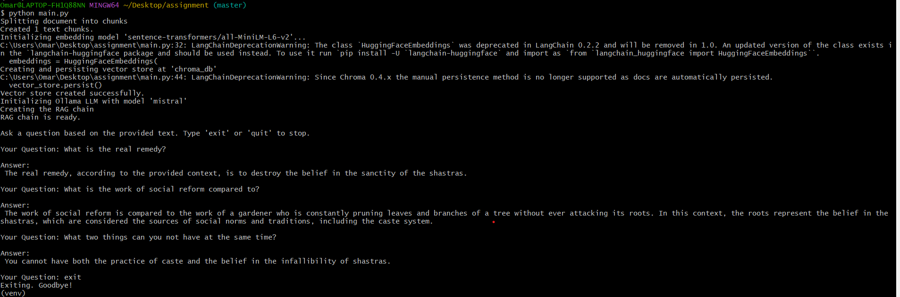

# AmbedkarGPT-Intern-Task

A Retrieval-Augmented Generation (RAG) application that allows users to ask questions about a specific text document using LangChain, ChromaDB, and Ollama.

##  Table of Contents

- [Overview](#overview)
- [Features](#features)
- [Architecture](#architecture)
- [Prerequisites](#prerequisites)
- [Installation](#installation)
- [Usage](#usage)
- [Configuration](#configuration)
- [Troubleshooting](#troubleshooting)
- [Output](#output)


##  Overview

This project implements a Question-Answering system using Retrieval-Augmented Generation (RAG). It processes a text document, creates embeddings, stores them in a vector database, and uses a Large Language Model (LLM) to answer questions based on the document's content.

**Key Technologies:**
- **LangChain**: Framework for developing applications powered by language models
- **ChromaDB**: Vector database for storing and retrieving embeddings
- **Ollama**: Local LLM runtime (using Mistral model)
- **Sentence Transformers**: For creating text embeddings
- **HuggingFace**: Pre-trained embedding models

##  Features

-  **Document Processing**: Automatically loads and splits text documents into manageable chunks
-  **Semantic Search**: Uses vector embeddings to find relevant context for user queries
-  **Local LLM**: Runs entirely locally using Ollama (no API keys required)
-  **Persistent Storage**: Vector database is saved to disk for reuse
-  **Interactive CLI**: Simple command-line interface for asking questions
-  **Efficient Retrieval**: Fast similarity search using ChromaDB

##  Architecture

```
┌─────────────────┐
│  speech.txt     │
│  (Input Doc)    │
└────────┬────────┘
         │
         ▼
┌─────────────────┐
│ Text Splitter   │
│ (500 char chunks)│
└────────┬────────┘
         │
         ▼
┌─────────────────┐
│  Embeddings     │
│ (MiniLM-L6-v2)  │
└────────┬────────┘
         │
         ▼
┌─────────────────┐
│   ChromaDB      │
│ (Vector Store)  │
└────────┬────────┘
         │
         ▼
┌─────────────────┐
│   Retriever     │
└────────┬────────┘
         │
         ▼
┌─────────────────┐
│  User Query     │
└────────┬────────┘
         │
         ▼
┌─────────────────┐
│  RAG Chain      │
│  (Context +     │
│   Question)     │
└────────┬────────┘
         │
         ▼
┌─────────────────┐
│  Ollama/Mistral │
│     (LLM)       │
└────────┬────────┘
         │
         ▼
┌─────────────────┐
│     Answer      │
└─────────────────┘
```

##  Prerequisites

Before running this project, ensure you have the following installed:

### System Requirements
- **Python**: 3.8 or higher
- **Ollama**: Latest version
- **Git**: For cloning the repository

### Install Ollama

**Windows/Mac/Linux:**
1. Download Ollama from [ollama.ai](https://ollama.ai)
2. Install and start Ollama
3. Pull the Mistral model:
   ```bash
   ollama pull mistral
   ```

To verify Ollama is running:
```bash
ollama list
```

##  Installation

### Step 1: Clone the Repository

```bash
git clone https://github.com/Omarbil01/AmbedkarGPT-Intern-Task.git
cd AmbedkarGPT-Intern-Task
```

### Step 2: Create Virtual Environment

**Windows:**
```bash
python -m venv venv
venv\Scripts\activate
```

**Linux/Mac:**
```bash
python3 -m venv venv
source venv/bin/activate
```

### Step 3: Install Dependencies

```bash
pip install --upgrade pip
pip install -r requirements.txt
```

If you encounter any issues, install packages individually:
```bash
pip install langchain langchain-community langchain-ollama chromadb sentence-transformers langchain-text-splitters langchain-core
```

### Step 4: Prepare Your Document

Place your text document in the project directory and name it `speech.txt`, or update the `TEXT_FILE_PATH` variable in `main.py` to point to your document.

##  Usage

### Running the Application

1. **Activate your virtual environment** (if not already activated)
2. **Run the script:**

```bash
python main.py
```

### First Run

On the first run, the application will:
1. Load and split your document
2. Generate embeddings
3. Create and persist the vector database
4. Initialize the LLM
5. Start the interactive Q&A session

### Subsequent Runs

The vector database is saved to disk, so subsequent runs will be faster as it loads the existing database.


### Exiting the Application

Type `exit` or `quit` to close the application, or press `Ctrl+C`.

##  Configuration

You can customize the following parameters in `main.py`:

```python
# File path to your text document
TEXT_FILE_PATH = "speech.txt"

# Embedding model from HuggingFace
EMBEDDING_MODEL_NAME = "sentence-transformers/all-MiniLM-L6-v2"

# Directory to store vector database
VECTOR_DB_DIRECTORY = "chroma_db"

# Ollama model name
LLM_MODEL_NAME = "mistral"

# Text splitting parameters
chunk_size = 500        # Size of each text chunk
chunk_overlap = 50      # Overlap between chunks
```

### Changing the LLM Model

To use a different Ollama model:

1. Pull the model: `ollama pull <model-name>`
2. Update `LLM_MODEL_NAME` in `main.py`

### GPU Acceleration

To use GPU for embeddings (if available):

Change this line in `main.py`:
```python
embeddings = HuggingFaceEmbeddings(
    model_name=EMBEDDING_MODEL_NAME,
    model_kwargs={'device': 'cuda'}  # Changed from 'cpu' to 'cuda'
)
```

##  Troubleshooting

### Common Issues

#### 1. `ModuleNotFoundError: No module named 'langchain.chains'`

**Solution:**
```bash
pip install --upgrade langchain langchain-core langchain-community
```

#### 2. Ollama Connection Error

**Solution:**
- Ensure Ollama is running: `ollama list`
- Check if Mistral is installed: `ollama pull mistral`
- Restart Ollama service

#### 3. Memory Issues with Large Documents

**Solution:**
- Reduce `chunk_size` in the code
- Use a smaller embedding model
- Process document in batches

#### 4. Slow Response Times

**Solution:**
- Use a faster/smaller LLM model
- Reduce the number of retrieved chunks
- Enable GPU acceleration if available

#### 5. Import Errors

**Solution:**
```bash
pip uninstall langchain langchain-core langchain-community
pip install langchain langchain-core langchain-community langchain-ollama
```

### Dependencies Version Conflicts

If you encounter dependency conflicts:

```bash
# Remove all langchain packages
pip uninstall langchain langchain-core langchain-community langchain-text-splitters -y

# Reinstall fresh
pip install langchain langchain-community langchain-ollama chromadb sentence-transformers
```

##  Output

### Sample Output Screenshot



### Expected Output Format

The application will display:
1. **Initialization logs**: Document loading, chunk creation, embedding generation
2. **Ready prompt**: Indication that the system is ready for questions
3. **Q&A interaction**: Your questions and the AI's answers
4. **Exit confirmation**: Clean shutdown message

### Performance Metrics

Typical performance on a standard laptop:
- **Initial setup time**: 30-60 seconds (first run only)
- **Subsequent startup**: 5-10 seconds
- **Query response time**: 3-10 seconds (depends on question complexity)
- **Vector database size**: ~5-50 MB (depends on document size)

